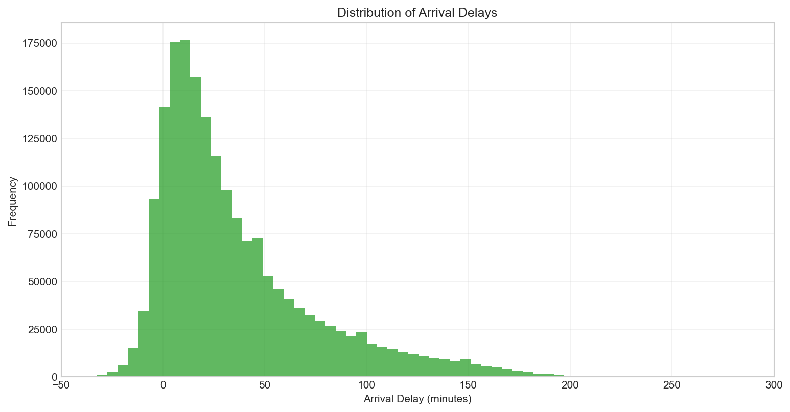
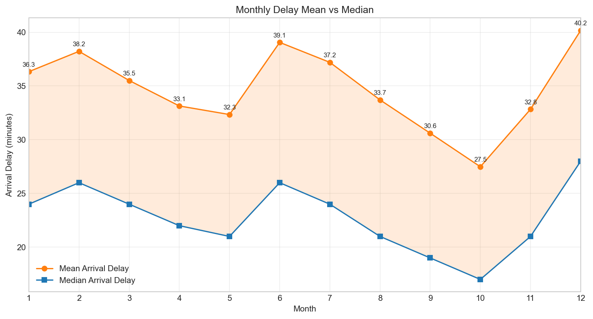
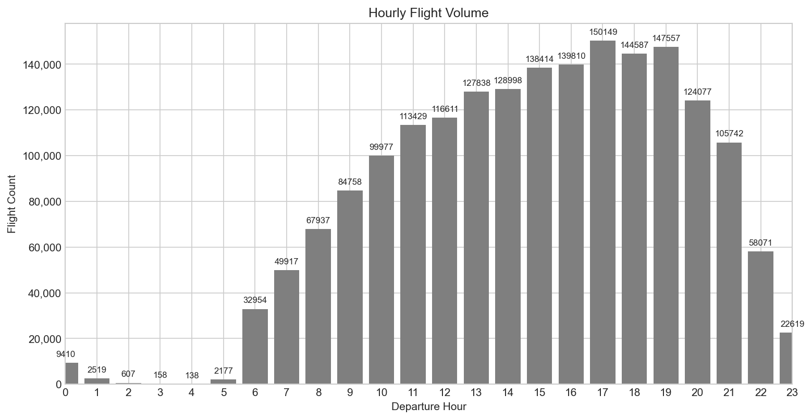
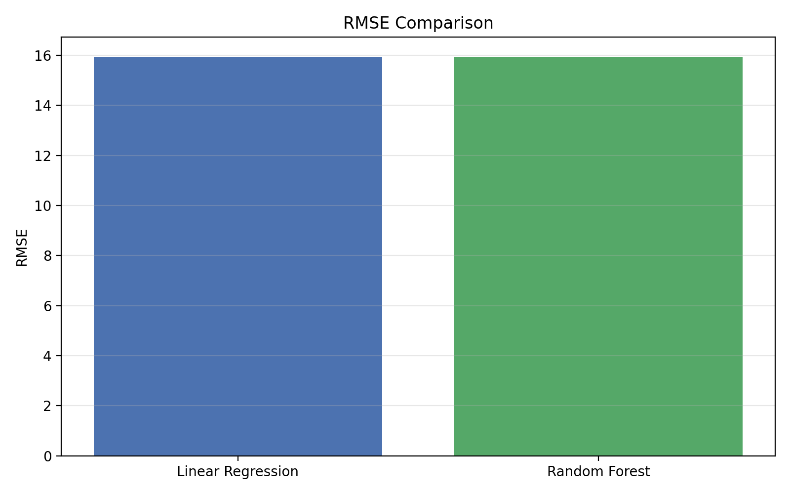
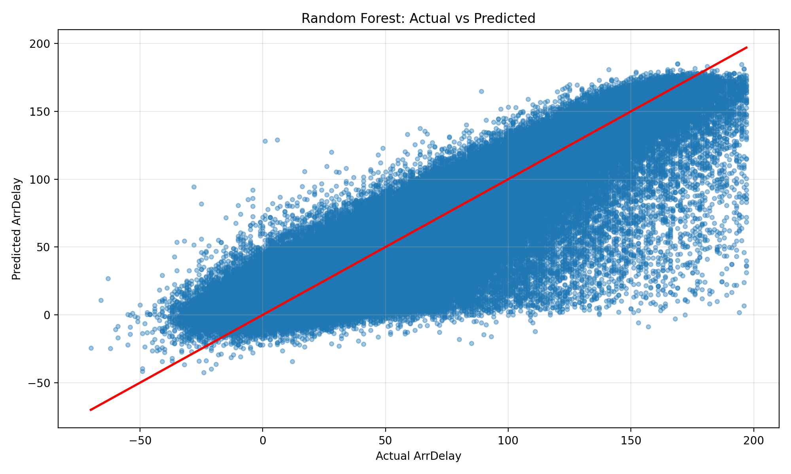

**Flight Delay Analysis & Prediction**

  

**Mô tả ngắn:** Dự án phân tích các yếu tố vận hành và lịch trình có liên quan mạnh nhất tới độ trễ chuyến bay đến (arrival delay), đồng thời xây dựng và so sánh các mô hình học máy sử dụng thông tin trước khởi hành để dự đoán thời gian đến muộn.

**Nghiên cứu:** Which operational and scheduling factors are most strongly associated with airline arrival delays, and to what extent can machine learning models predict these delays using pre-departure information?

**Trạng thái:** Proof-of-concept — EDA, feature engineering, mô hình hóa (Linear Regression, Random Forest) và ứng dụng trình diễn bằng Streamlit.

**Hình minh họa (ví dụ):**



**Tác giả:** (Thêm tên của bạn ở đây)

----

**Project Highlights**
- **Scope:** Phân tích dữ liệu lịch sử chuyến bay, rút trích đặc trưng trước khởi hành và dự đoán `arrival delay` (phút).
- **Models:** Linear Regression, Random Forest (tuned), so sánh bằng MAE / RMSE / R^2.
- **Delivery:** Jupyter notebooks cho EDA & modeling, script huấn luyện, mô hình lưu trữ trong `models/`, và Streamlit dashboard trong `app/`.

----

**Research Question**
- **Core question:** Which operational and scheduling factors most strongly associate with arrival delays, and how well can pre-departure features predict them?
- **Motivation:** Cải thiện lập kế hoạch, giảm delay chuỗi (delay propagation), và hỗ trợ ra quyết định vận hành cho hãng hàng không/phi trường.

----

**Dataset Description**
- **Source files:** See [data/cleaned_flights.csv](data/cleaned_flights.csv) and [data/processed_flight_data.csv](data/processed_flight_data.csv).
- **Key fields:** `YEAR`, `MONTH`, `DAY`, `DEP_TIME`, `CRS_DEP_TIME`, `ARR_DELAY`, `DEP_DELAY`, `OP_CARRIER`, `ORIGIN`, `DEST`, `DISTANCE`, `DAY_OF_WEEK`.
- **Preprocessing:** Làm sạch bản ghi, xử lý giá trị thiếu, chuẩn hóa thời gian, tạo biến giờ (hour), biến lịch (month/week), và xử lý categorical (one-hot / target encoding) trong bước feature engineering.

----

**EDA Insights**
- **Seasonality:** Trung bình delay thay đổi theo tháng; ảnh: .
- **Hourly patterns:** Volume và delay khác nhau theo giờ, có giờ cao điểm với delay cao hơn: .
- **Carrier / Airport effects:** Một số hãng/phi trường có xu hướng delay cao hơn (xem `carrier_delay_mean_median.png`, `airport_traffic_vs_delay.png`).
- **Correlation:** Các biến như `DEP_DELAY`, `CRS_DEP_TIME`, và `carrier` có tương quan đáng kể với `ARR_DELAY` (xem `correlation_matrix.png`).

----

**Feature Engineering**
- **Time features:** `scheduled_hour`, `day_of_week`, `month`, `is_peak_hour`.
- **Operational features:** `dep_delay`, `carrier`, `origin`, `dest`, `distance`.
- **Historical / aggregated features:** trung bình delay theo carrier/hour/airport trong lịch sử (rolling/lag features khi có sẵn).
- **Encoding & scaling:** Categorical encoding (one-hot / target-encode) và `StandardScaler` cho các biến số.

----

**Machine Learning Models**
- **Baseline:** Linear Regression — fast, interpretable.
- **Tree-based:** Random Forest — xử lý non-linearity và interactions, kèm `feature_importance` để hiểu đóng góp biến.
- **Evaluation metrics:** MAE, RMSE, R^2 (ưu tiên MAE cho lỗi trung bình đơn vị phút).

----

**Results**
- **Random Forest:** MAE = 10.93, RMSE = 15.94, R^2 = 0.8303 (từ `models/random_forest_metrics.csv`).
- **Linear Regression:** MAE = 10.80, RMSE = 15.94, R^2 = 0.8302 (từ `models/linear_regression_metrics.csv`).
- **Nhận xét:** Cả hai mô hình đạt hiệu năng tương tự theo các metric cơ bản; Random Forest cung cấp thêm thông tin về thứ tự quan trọng của biến (`images/rf_feature_importance.png`) và đồ thị dự đoán so với thực tế (`images/rf_actual_vs_predicted.png`).



----

**Streamlit Dashboard**
- **Mục tiêu:** Cho phép người dùng tương tác với dữ liệu đầu vào (carrier, origin, dest, scheduled time, distance) và xem dự đoán `arrival delay` theo mô hình đã lưu.
- **Location:** [app/streamlit_app.py](app/streamlit_app.py#L1)
- **Screenshot / demo:**



----

**Project Structure**
- **Root:**
  - [data/](data)
    - [cleaned_flights.csv](data/cleaned_flights.csv)
    - [processed_flight_data.csv](data/processed_flight_data.csv)
  - [notebooks/](notebooks)
  - [app/](app)
    - [streamlit_app.py](app/streamlit_app.py#L1)
    - [model_utils.py](app/model_utils.py#L1)
  - [models/](models)
    - `random_forest_arrdelay.joblib`, `linear_regression_arrdelay.joblib`
    - [random_forest_metrics.csv](models/random_forest_metrics.csv)
  - [images/](images) — biểu đồ & ảnh minh họa
  - `requirements.txt`

----

**Installation**
1. Clone repo:

```bash
git clone <your-repo-url>
cd flight-delay-project
```

2. Tạo và kích hoạt virtual environment:

```bash
python -m venv venv
venv\Scripts\activate    # Windows
```

3. Cài đặt phụ thuộc:

```bash
pip install -r requirements.txt
```

----

**How to Run**
- Chạy Streamlit dashboard (local):

```bash
streamlit run app/streamlit_app.py
```

- Huấn luyện mô hình (ví dụ Random Forest):

```bash
python app/train_random_forest.py
```

- Kiểm tra mô hình đã lưu trong `models/` và đánh giá bằng notebooks trong `notebooks/`.

----

**Future Improvements**
- **Feature enrichment:** Thêm dữ liệu thời tiết, thông tin phi trường thời gian thực, dữ liệu ATC để cải thiện dự đoán.
- **Modeling:** Thử XGBoost / LightGBM, hyperparameter tuning sâu hơn, ensembling.
- **Temporal models:** Xem xét mô hình chuỗi thời gian hoặc giải pháp sequence-to-sequence để nắm bắt delay propagation.
- **Deployment:** CI/CD + dockerize ứng dụng Streamlit, cung cấp API inference (FastAPI) và tự động hoá retraining.
- **Explainability:** SHAP/LIME cho interpretability và dashboard giải thích quyết định mô hình.

----

Nếu bạn muốn, tôi có thể commit thay đổi này vào repo và/hoặc tạo file `README_en.md` (English) tương ứng.

